# 📈 Finstox

**Finstox** is a sleek, beginner-friendly stock trading app built using **React Native** with **Expo**. It enables users to sign up, view live stock data, place buy orders, and manage their portfolio with a beautiful and intuitive mobile interface.

🔗 GitHub Repo: [kanhaiyaongithub/Finstox](https://github.com/kanhaiyaongithub/Finstox)

---

## ✨ Features

- 🔐 JWT-based secure Login & Signup
- 📊 Browse live NSE stock listings
- 📈 View stock charts and price data
- 🛒 Place buy orders directly in-app
- 🧾 Track orders and portfolio holdings
- ⭐ Watchlist support (add/remove favorite stocks)
- 🧠 Clean, intuitive UI built with React Native + Expo

---

## 📱 Screenshots

### 🔥 Splash & Authentication
<p align="center">
  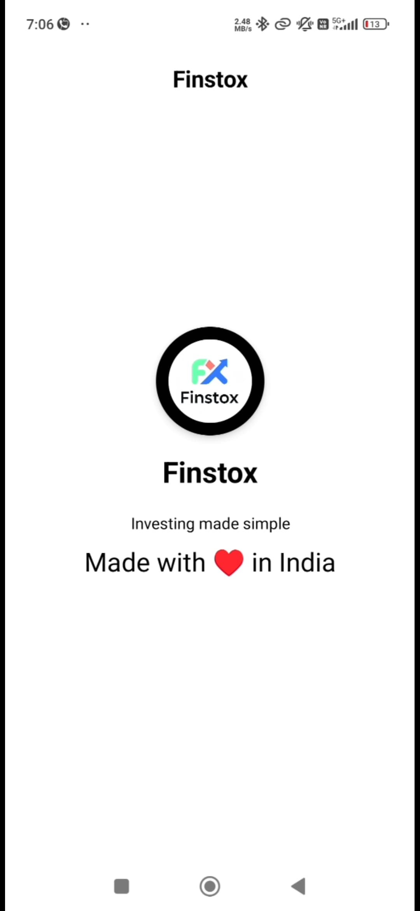
  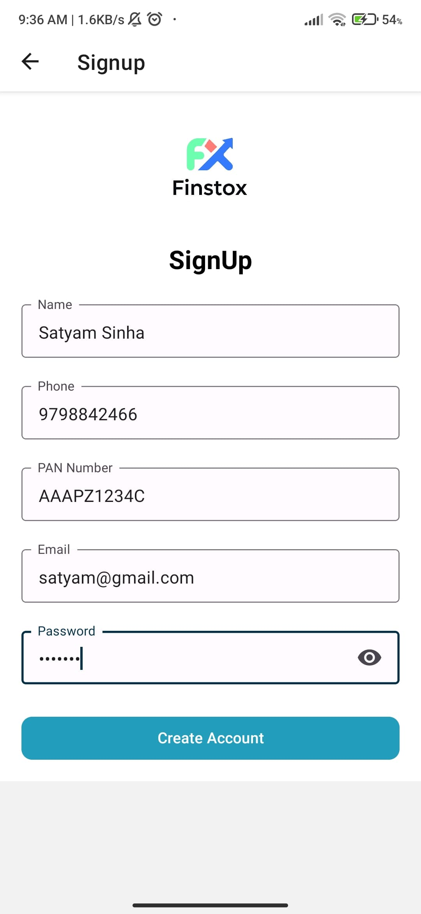
  
</p>

---

### 🏠 Home & Stock Info
<p align="center">
  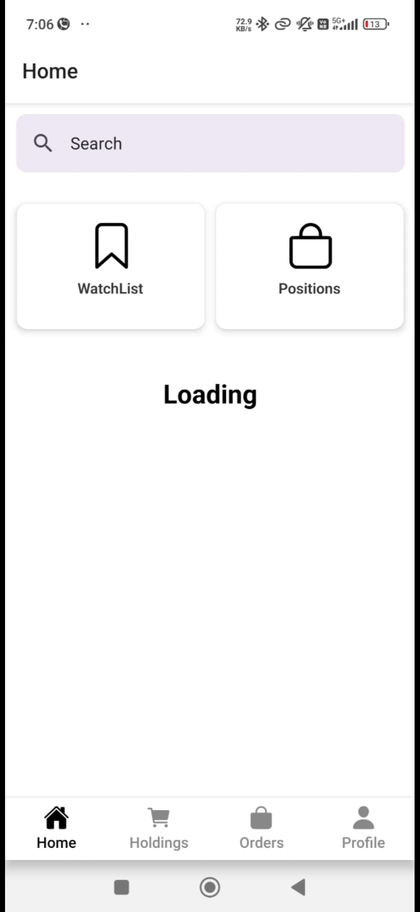
  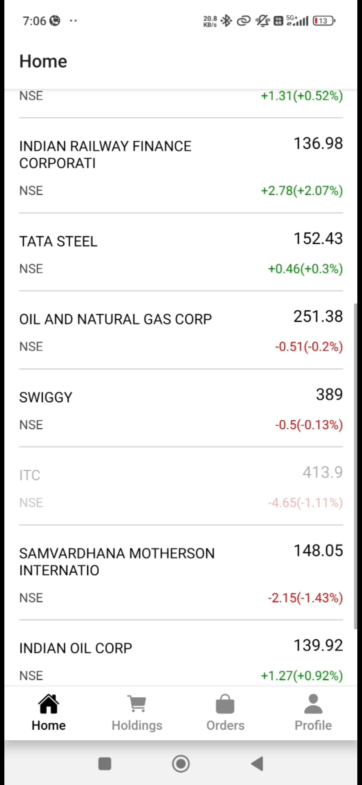
  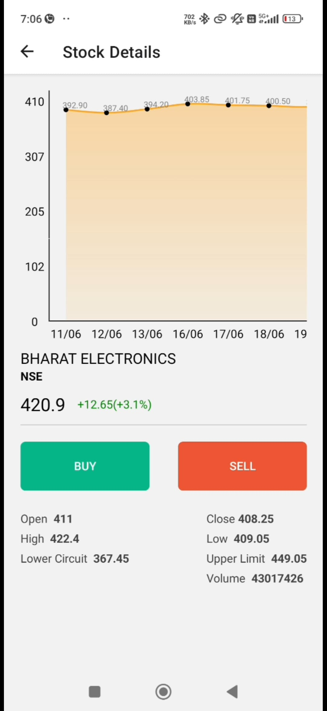
</p>

---

### 💸 Transactions & Orders
<p align="center">
  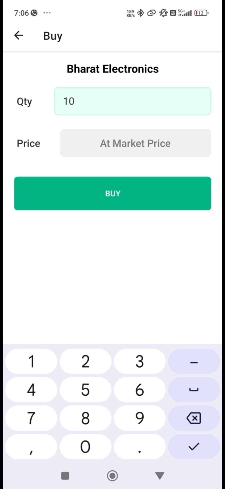
  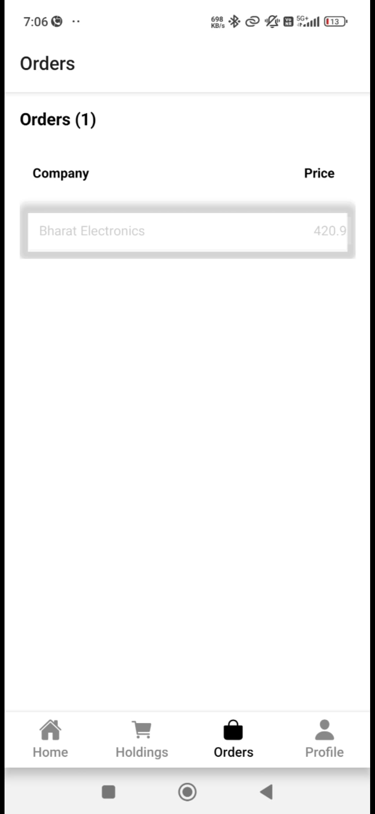
  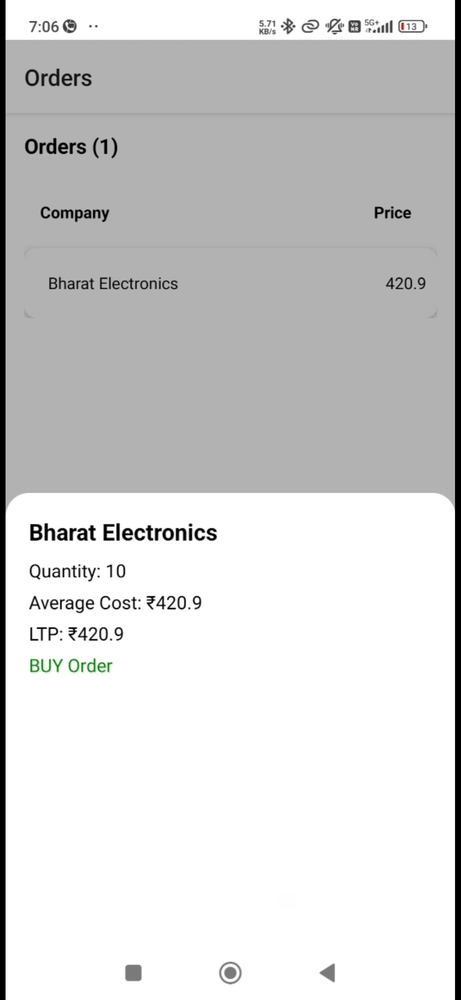
</p>

---

### 👤 Profile & Portfolio
<p align="center">
  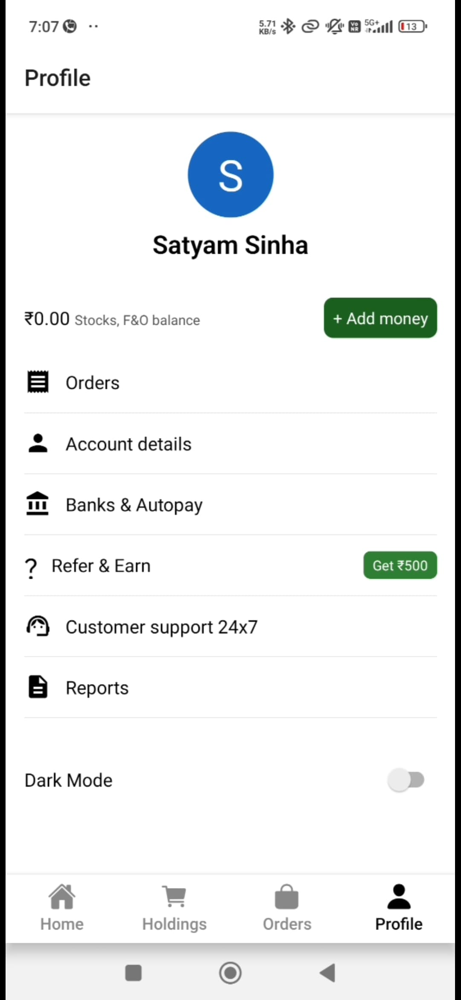
  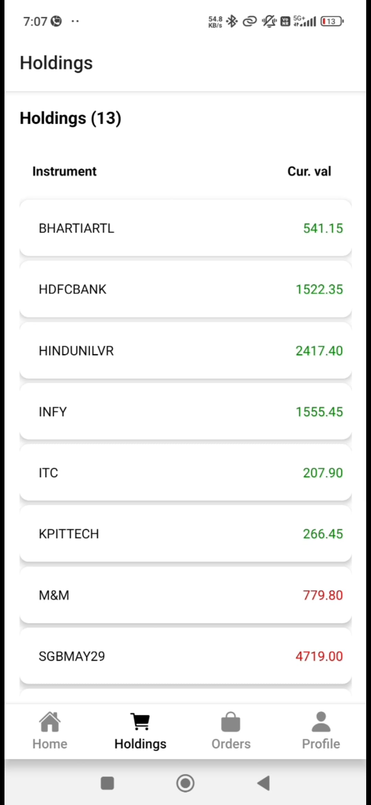
  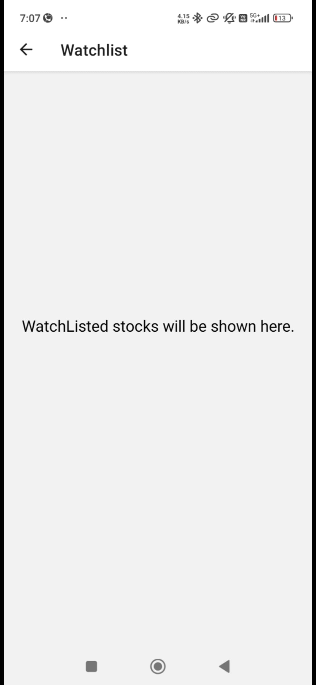
</p>

---

## 🛠️ Tech Stack

- **React Native** with [Expo](https://expo.dev/)
- **React Navigation** for routing
- **MongoDB** – cloud-hosted database
- **JWT (JSON Web Token)** for secure authentication
- **Axios** for API calls
- **AsyncStorage** for local token handling
- **React Native Chart Kit** for graphs
- Modular architecture with custom hooks and reusable components

---

## 🚀 Getting Started

### Prerequisites

- Node.js
- Expo CLI (`npm install -g expo-cli`)
- Android Studio / iOS Simulator / Expo Go App

### Installation

```bash
git clone https://github.com/kanhaiyaongithub/Finstox.git
cd Finstox/frontend
npm install
expo start
